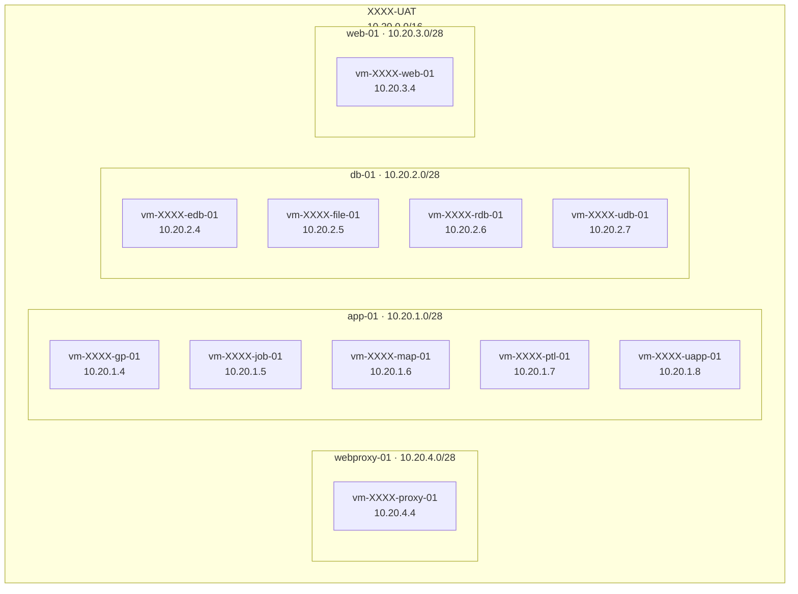
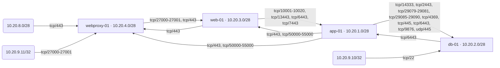
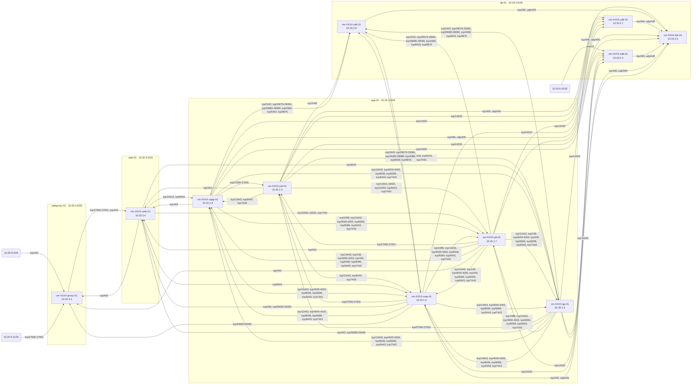

# AWS network diagram

Generated from EC2 in ap-southeast-1. Arrows are inbound security-group allow rules.

Instances: 11. Subnets: 4. VPCs: 1. Security groups: 13. Edges: 60.

## Layout

Where hosts live: VPC, subnet, private IP.

## Access between subnets

Same rules rolled up per subnet. Traffic inside a subnet is not drawn.

## Access between hosts

Full host-to-host detail, including same-subnet traffic.

## Hosts

| Host | Private IP | Subnet | Security groups |
| --- | --- | --- | --- |
| vm-XXXX-gp-01 | 10.20.1.4 | sub-XXXX-app-01 | sgrp-XXXX-adjoin-01, sgrp-XXXX-gp-01, sgrp-XXXX-soe |
| vm-XXXX-job-01 | 10.20.1.5 | sub-XXXX-app-01 | sgrp-XXXX-adjoin-01, sgrp-XXXX-job-01, sgrp-XXXX-soe |
| vm-XXXX-map-01 | 10.20.1.6 | sub-XXXX-app-01 | sgrp-XXXX-adjoin-01, sgrp-XXXX-soe, sgrp-XXXX-map-01 |
| vm-XXXX-ptl-01 | 10.20.1.7 | sub-XXXX-app-01 | sgrp-XXXX-adjoin-01, sgrp-XXXX-soe, sgrp-XXXX-ptl-01 |
| vm-XXXX-uapp-01 | 10.20.1.8 | sub-XXXX-app-01 | sgrp-XXXX-adjoin-01, sgrp-XXXX-soe, sgrp-XXXX-uapp-01 |
| vm-XXXX-web-01 | 10.20.3.4 | sub-XXXX-web-01 | sgrp-XXXX-adjoin-01, sgrp-XXXX-soe, sgrp-XXXX-web-01 |
| vm-XXXX-edb-01 | 10.20.2.4 | sub-XXXX-db-01 | sgrp-XXXX-adjoin-01, sgrp-XXXX-edb-01 |
| vm-XXXX-file-01 | 10.20.2.5 | sub-XXXX-db-01 | sgrp-XXXX-adjoin-01, sgrp-XXXX-file-01 |
| vm-XXXX-rdb-01 | 10.20.2.6 | sub-XXXX-db-01 | sgrp-XXXX-adjoin-01, sgrp-XXXX-rdb-01 |
| vm-XXXX-udb-01 | 10.20.2.7 | sub-XXXX-db-01 | sgrp-XXXX-adjoin-01, sgrp-XXXX-udb-01 |
| vm-XXXX-proxy-01 | 10.20.4.4 | sub-XXXX-webproxy-01 | sgrp-XXXX-adjoin-01, sgrp-XXXX-soe, sgrp-XXXX-webproxy-01 |
