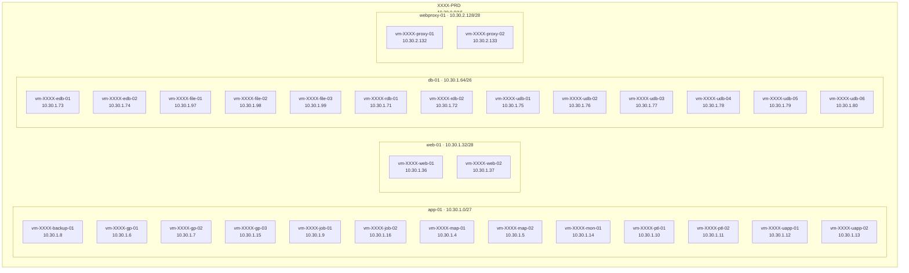
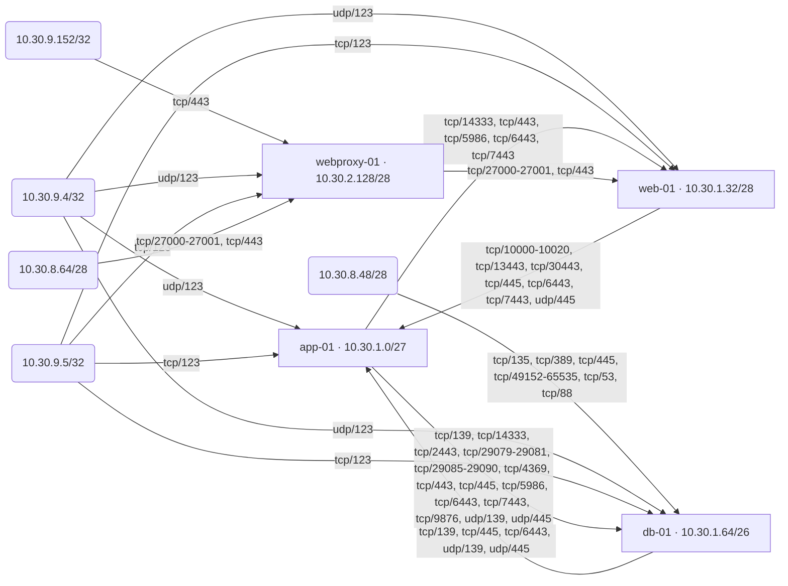

# AWS network diagram
 
Generated from EC2 in ap-southeast-1. Arrows are inbound security-group allow rules.
 
Instances: 30. Subnets: 4. VPCs: 1. Security groups: 18. Edges: 476.
 
## Layout
 
Where hosts live: VPC, subnet, private IP.
 

 
## Access between subnets
 
Same rules rolled up per subnet. Traffic inside a subnet is not drawn.
 

 
## Access between hosts
 
Full host-to-host detail, including same-subnet traffic.
 
```mermaid
flowchart LR
  subgraph group_app_01["app-01 · 10.30.1.0/27"]
    vm_XXXX_backup_01["vm-XXXX-backup-01<br/>10.30.1.8"]
    vm_XXXX_gp_01["vm-XXXX-gp-01<br/>10.30.1.6"]
    vm_XXXX_gp_02["vm-XXXX-gp-02<br/>10.30.1.7"]
    vm_XXXX_gp_03["vm-XXXX-gp-03<br/>10.30.1.15"]
    vm_XXXX_job_01["vm-XXXX-job-01<br/>10.30.1.9"]
    vm_XXXX_job_02["vm-XXXX-job-02<br/>10.30.1.16"]
    vm_XXXX_map_01["vm-XXXX-map-01<br/>10.30.1.4"]
    vm_XXXX_map_02["vm-XXXX-map-02<br/>10.30.1.5"]
    vm_XXXX_mon_01["vm-XXXX-mon-01<br/>10.30.1.14"]
    vm_XXXX_ptl_01["vm-XXXX-ptl-01<br/>10.30.1.10"]
    vm_XXXX_ptl_02["vm-XXXX-ptl-02<br/>10.30.1.11"]
    vm_XXXX_uapp_01["vm-XXXX-uapp-01<br/>10.30.1.12"]
    vm_XXXX_uapp_02["vm-XXXX-uapp-02<br/>10.30.1.13"]
  end
  subgraph group_web_01["web-01 · 10.30.1.32/28"]
    vm_XXXX_web_01["vm-XXXX-web-01<br/>10.30.1.36"]
    vm_XXXX_web_02["vm-XXXX-web-02<br/>10.30.1.37"]
  end
  subgraph group_db_01["db-01 · 10.30.1.64/26"]
    vm_XXXX_edb_01["vm-XXXX-edb-01<br/>10.30.1.73"]
    vm_XXXX_edb_02["vm-XXXX-edb-02<br/>10.30.1.74"]
    vm_XXXX_file_01["vm-XXXX-file-01<br/>10.30.1.97"]
    vm_XXXX_file_02["vm-XXXX-file-02<br/>10.30.1.98"]
    vm_XXXX_file_03["vm-XXXX-file-03<br/>10.30.1.99"]
    vm_XXXX_rdb_01["vm-XXXX-rdb-01<br/>10.30.1.71"]
    vm_XXXX_rdb_02["vm-XXXX-rdb-02<br/>10.30.1.72"]
    vm_XXXX_udb_01["vm-XXXX-udb-01<br/>10.30.1.75"]
    vm_XXXX_udb_02["vm-XXXX-udb-02<br/>10.30.1.76"]
    vm_XXXX_udb_03["vm-XXXX-udb-03<br/>10.30.1.77"]
    vm_XXXX_udb_04["vm-XXXX-udb-04<br/>10.30.1.78"]
    vm_XXXX_udb_05["vm-XXXX-udb-05<br/>10.30.1.79"]
    vm_XXXX_udb_06["vm-XXXX-udb-06<br/>10.30.1.80"]
  end
  subgraph group_webproxy_01["webproxy-01 · 10.30.2.128/28"]
    vm_XXXX_proxy_01["vm-XXXX-proxy-01<br/>10.30.2.132"]
    vm_XXXX_proxy_02["vm-XXXX-proxy-02<br/>10.30.2.133"]
  end
  ext_host_01("10.30.9.152/32")
  ext_host_02("10.30.8.48/28")
  ext_host_03("10.30.9.4/32")
  ext_host_04("10.30.9.5/32")
  ext_host_05("10.30.8.64/28")
  ext_host_01 -- "tcp/443" --> vm_XXXX_proxy_02
  ext_host_01 -- "tcp/443" --> vm_XXXX_proxy_01
  ext_host_02 -- "tcp/135, tcp/389, tcp/445, tcp/49152-65535, tcp/53, tcp/88" --> vm_XXXX_udb_02
  ext_host_02 -- "tcp/135, tcp/389, tcp/445, tcp/49152-65535, tcp/53, tcp/88" --> vm_XXXX_edb_02
  ext_host_02 -- "tcp/135, tcp/389, tcp/445, tcp/49152-65535, tcp/53, tcp/88" --> vm_XXXX_edb_01
  ext_host_02 -- "tcp/135, tcp/389, tcp/445, tcp/49152-65535, tcp/53, tcp/88" --> vm_XXXX_udb_01
  ext_host_03 -- "udp/123" --> vm_XXXX_udb_02
  ext_host_03 -- "udp/123" --> vm_XXXX_edb_02
  ext_host_03 -- "udp/123" --> vm_XXXX_edb_01
  ext_host_03 -- "udp/123" --> vm_XXXX_rdb_01
  ext_host_03 -- "udp/123" --> vm_XXXX_ptl_02
  ext_host_03 -- "udp/123" --> vm_XXXX_job_01
  ext_host_03 -- "udp/123" --> vm_XXXX_web_01
  ext_host_03 -- "udp/123" --> vm_XXXX_udb_01
  ext_host_03 -- "udp/123" --> vm_XXXX_job_02
  ext_host_03 -- "udp/123" --> vm_XXXX_file_01
  ext_host_03 -- "udp/123" --> vm_XXXX_udb_04
  ext_host_03 -- "udp/123" --> vm_XXXX_uapp_01
  ext_host_03 -- "udp/123" --> vm_XXXX_map_01
  ext_host_03 -- "udp/123" --> vm_XXXX_gp_03
  ext_host_03 -- "udp/123" --> vm_XXXX_rdb_02
  ext_host_03 -- "udp/123" --> vm_XXXX_file_03
  ext_host_03 -- "udp/123" --> vm_XXXX_web_02
  ext_host_03 -- "udp/123" --> vm_XXXX_ptl_01
  ext_host_03 -- "udp/123" --> vm_XXXX_gp_02
  ext_host_03 -- "udp/123" --> vm_XXXX_uapp_02
  ext_host_03 -- "udp/123" --> vm_XXXX_proxy_02
  ext_host_03 -- "udp/123" --> vm_XXXX_backup_01
  ext_host_03 -- "udp/123" --> vm_XXXX_mon_01
  ext_host_03 -- "udp/123" --> vm_XXXX_gp_01
  ext_host_03 -- "udp/123" --> vm_XXXX_file_02
  ext_host_03 -- "udp/123" --> vm_XXXX_map_02
  ext_host_03 -- "udp/123" --> vm_XXXX_udb_06
  ext_host_03 -- "udp/123" --> vm_XXXX_udb_05
  ext_host_03 -- "udp/123" --> vm_XXXX_udb_03
  ext_host_03 -- "udp/123" --> vm_XXXX_proxy_01
  ext_host_04 -- "tcp/123" --> vm_XXXX_udb_02
  ext_host_04 -- "tcp/123" --> vm_XXXX_edb_02
  ext_host_04 -- "tcp/123" --> vm_XXXX_edb_01
  ext_host_04 -- "tcp/123" --> vm_XXXX_rdb_01
  ext_host_04 -- "tcp/123" --> vm_XXXX_ptl_02
  ext_host_04 -- "tcp/123" --> vm_XXXX_job_01
  ext_host_04 -- "tcp/123" --> vm_XXXX_web_01
  ext_host_04 -- "tcp/123" --> vm_XXXX_udb_01
  ext_host_04 -- "tcp/123" --> vm_XXXX_job_02
  ext_host_04 -- "tcp/123" --> vm_XXXX_file_01
  ext_host_04 -- "tcp/123" --> vm_XXXX_udb_04
  ext_host_04 -- "tcp/123" --> vm_XXXX_uapp_01
  ext_host_04 -- "tcp/123" --> vm_XXXX_map_01
  ext_host_04 -- "tcp/123" --> vm_XXXX_gp_03
  ext_host_04 -- "tcp/123" --> vm_XXXX_rdb_02
  ext_host_04 -- "tcp/123" --> vm_XXXX_file_03
  ext_host_04 -- "tcp/123" --> vm_XXXX_web_02
  ext_host_04 -- "tcp/123" --> vm_XXXX_ptl_01
  ext_host_04 -- "tcp/123" --> vm_XXXX_gp_02
  ext_host_04 -- "tcp/123" --> vm_XXXX_uapp_02
  ext_host_04 -- "tcp/123" --> vm_XXXX_proxy_02
  ext_host_04 -- "tcp/123" --> vm_XXXX_backup_01
  ext_host_04 -- "tcp/123" --> vm_XXXX_mon_01
  ext_host_04 -- "tcp/123" --> vm_XXXX_gp_01
  ext_host_04 -- "tcp/123" --> vm_XXXX_file_02
  ext_host_04 -- "tcp/123" --> vm_XXXX_map_02
  ext_host_04 -- "tcp/123" --> vm_XXXX_udb_06
  ext_host_04 -- "tcp/123" --> vm_XXXX_udb_05
  ext_host_04 -- "tcp/123" --> vm_XXXX_udb_03
  ext_host_04 -- "tcp/123" --> vm_XXXX_proxy_01
  ext_host_05 -- "tcp/27000-27001, tcp/443" --> vm_XXXX_proxy_02
  ext_host_05 -- "tcp/27000-27001, tcp/443" --> vm_XXXX_proxy_01
  vm_XXXX_udb_02 -- "tcp/445" --> vm_XXXX_edb_02
  vm_XXXX_udb_02 -- "tcp/445" --> vm_XXXX_edb_01
  vm_XXXX_udb_02 -- "all" --> vm_XXXX_udb_01
  vm_XXXX_udb_02 -- "tcp/139, tcp/445, udp/139, udp/445" --> vm_XXXX_file_01
  vm_XXXX_udb_02 -- "tcp/139, tcp/445, udp/139, udp/445" --> vm_XXXX_file_03
  vm_XXXX_udb_02 -- "tcp/139, tcp/445, udp/139, udp/445" --> vm_XXXX_backup_01
  vm_XXXX_udb_02 -- "tcp/139, tcp/445, udp/139, udp/445" --> vm_XXXX_file_02
  vm_XXXX_edb_02 -- "all" --> vm_XXXX_edb_01
  vm_XXXX_edb_02 -- "tcp/139, tcp/445, udp/139, udp/445" --> vm_XXXX_file_01
  vm_XXXX_edb_02 -- "tcp/139, tcp/445, udp/139, udp/445" --> vm_XXXX_file_03
  vm_XXXX_edb_02 -- "tcp/139, tcp/445, udp/139, udp/445" --> vm_XXXX_backup_01
  vm_XXXX_edb_02 -- "tcp/139, tcp/445, udp/139, udp/445" --> vm_XXXX_file_02
  vm_XXXX_edb_01 -- "all" --> vm_XXXX_edb_02
  vm_XXXX_edb_01 -- "tcp/139, tcp/445, udp/139, udp/445" --> vm_XXXX_file_01
  vm_XXXX_edb_01 -- "tcp/139, tcp/445, udp/139, udp/445" --> vm_XXXX_file_03
  vm_XXXX_edb_01 -- "tcp/139, tcp/445, udp/139, udp/445" --> vm_XXXX_backup_01
  vm_XXXX_edb_01 -- "tcp/139, tcp/445, udp/139, udp/445" --> vm_XXXX_file_02
  vm_XXXX_rdb_01 -- "tcp/139, tcp/445, udp/139, udp/445" --> vm_XXXX_file_01
  vm_XXXX_rdb_01 -- "tcp/6443" --> vm_XXXX_map_01
  vm_XXXX_rdb_01 -- "all" --> vm_XXXX_rdb_02
  vm_XXXX_rdb_01 -- "tcp/139, tcp/445, udp/139, udp/445" --> vm_XXXX_file_03
  vm_XXXX_rdb_01 -- "tcp/139, tcp/445, udp/139, udp/445" --> vm_XXXX_backup_01
  vm_XXXX_rdb_01 -- "tcp/139, tcp/445, udp/139, udp/445" --> vm_XXXX_file_02
  vm_XXXX_rdb_01 -- "tcp/6443" --> vm_XXXX_map_02
  vm_XXXX_ptl_02 -- "tcp/14333" --> vm_XXXX_udb_02
  vm_XXXX_ptl_02 -- "tcp/14333" --> vm_XXXX_edb_02
  vm_XXXX_ptl_02 -- "tcp/14333" --> vm_XXXX_edb_01
  vm_XXXX_ptl_02 -- "tcp/2443, tcp/29079-29081, tcp/29085-29090, tcp/4369, tcp/6443, tcp/9876" --> vm_XXXX_rdb_01
  vm_XXXX_ptl_02 -- "tcp/27000-27001" --> vm_XXXX_job_01
  vm_XXXX_ptl_02 -- "tcp/443" --> vm_XXXX_web_01
  vm_XXXX_ptl_02 -- "tcp/14333" --> vm_XXXX_udb_01
  vm_XXXX_ptl_02 -- "tcp/27000-27001" --> vm_XXXX_job_02
  vm_XXXX_ptl_02 -- "tcp/139, tcp/445, udp/139, udp/445" --> vm_XXXX_file_01
  vm_XXXX_ptl_02 -- "tcp/14333" --> vm_XXXX_udb_04
  vm_XXXX_ptl_02 -- "tcp/1098, tcp/1098-7443, tcp/13443, tcp/139, tcp/4000-4003, tcp/445, tcp/6006, tcp/6099, tcp/6443, tcp/7443" --> vm_XXXX_uapp_01
  vm_XXXX_ptl_02 -- "tcp/1098, tcp/1098-7443, tcp/13443, tcp/139, tcp/4000-4003, tcp/445, tcp/6006, tcp/6099, tcp/6443, tcp/7443" --> vm_XXXX_map_01
  vm_XXXX_ptl_02 -- "tcp/1098, tcp/1098-7443, tcp/13443, tcp/139, tcp/4000-4003, tcp/445, tcp/6006, tcp/6099, tcp/6443, tcp/7443" --> vm_XXXX_gp_03
  vm_XXXX_ptl_02 -- "tcp/2443, tcp/29079-29081, tcp/29085-29090, tcp/4369, tcp/6443, tcp/9876" --> vm_XXXX_rdb_02
  vm_XXXX_ptl_02 -- "tcp/139, tcp/445, udp/139, udp/445" --> vm_XXXX_file_03
  vm_XXXX_ptl_02 -- "tcp/443" --> vm_XXXX_web_02
  vm_XXXX_ptl_02 -- "all" --> vm_XXXX_ptl_01
  vm_XXXX_ptl_02 -- "tcp/1098, tcp/1098-7443, tcp/13443, tcp/139, tcp/4000-4003, tcp/445, tcp/6006, tcp/6099, tcp/6443, tcp/7443" --> vm_XXXX_gp_02
  vm_XXXX_ptl_02 -- "tcp/1098, tcp/1098-7443, tcp/13443, tcp/139, tcp/4000-4003, tcp/445, tcp/6006, tcp/6099, tcp/6443, tcp/7443" --> vm_XXXX_uapp_02
  vm_XXXX_ptl_02 -- "tcp/139, tcp/445, udp/139, udp/445" --> vm_XXXX_backup_01
  vm_XXXX_ptl_02 -- "tcp/1098, tcp/1098-7443, tcp/13443, tcp/139, tcp/4000-4003, tcp/445, tcp/6006, tcp/6099, tcp/6443, tcp/7443" --> vm_XXXX_gp_01
  vm_XXXX_ptl_02 -- "tcp/139, tcp/445, udp/139, udp/445" --> vm_XXXX_file_02
  vm_XXXX_ptl_02 -- "tcp/1098, tcp/1098-7443, tcp/13443, tcp/139, tcp/4000-4003, tcp/445, tcp/6006, tcp/6099, tcp/6443, tcp/7443" --> vm_XXXX_map_02
  vm_XXXX_ptl_02 -- "tcp/14333" --> vm_XXXX_udb_06
  vm_XXXX_ptl_02 -- "tcp/14333" --> vm_XXXX_udb_05
  vm_XXXX_ptl_02 -- "tcp/14333" --> vm_XXXX_udb_03
  vm_XXXX_job_01 -- "tcp/14333" --> vm_XXXX_udb_02
  vm_XXXX_job_01 -- "tcp/14333" --> vm_XXXX_edb_02
  vm_XXXX_job_01 -- "tcp/14333" --> vm_XXXX_edb_01
  vm_XXXX_job_01 -- "tcp/2443" --> vm_XXXX_rdb_01
  vm_XXXX_job_01 -- "tcp/10000-10020, tcp/6443, tcp/7443" --> vm_XXXX_ptl_02
  vm_XXXX_job_01 -- "tcp/443" --> vm_XXXX_web_01
  vm_XXXX_job_01 -- "tcp/14333" --> vm_XXXX_udb_01
  vm_XXXX_job_01 -- "all, tcp/27000-27001" --> vm_XXXX_job_02
  vm_XXXX_job_01 -- "tcp/139, tcp/445, udp/139, udp/445" --> vm_XXXX_file_01
  vm_XXXX_job_01 -- "tcp/14333" --> vm_XXXX_udb_04
  vm_XXXX_job_01 -- "tcp/6443, tcp/7443" --> vm_XXXX_uapp_01
  vm_XXXX_job_01 -- "tcp/6443, tcp/7443" --> vm_XXXX_map_01
  vm_XXXX_job_01 -- "tcp/6443, tcp/7443" --> vm_XXXX_gp_03
  vm_XXXX_job_01 -- "tcp/2443" --> vm_XXXX_rdb_02
  vm_XXXX_job_01 -- "tcp/139, tcp/445, udp/139, udp/445" --> vm_XXXX_file_03
  vm_XXXX_job_01 -- "tcp/443" --> vm_XXXX_web_02
  vm_XXXX_job_01 -- "tcp/10000-10020, tcp/6443, tcp/7443" --> vm_XXXX_ptl_01
  vm_XXXX_job_01 -- "tcp/6443, tcp/7443" --> vm_XXXX_gp_02
  vm_XXXX_job_01 -- "tcp/6443, tcp/7443" --> vm_XXXX_uapp_02
  vm_XXXX_job_01 -- "tcp/139, tcp/445, udp/139, udp/445" --> vm_XXXX_backup_01
  vm_XXXX_job_01 -- "tcp/6443, tcp/7443" --> vm_XXXX_gp_01
  vm_XXXX_job_01 -- "tcp/139, tcp/445, udp/139, udp/445" --> vm_XXXX_file_02
  vm_XXXX_job_01 -- "tcp/6443, tcp/7443" --> vm_XXXX_map_02
  vm_XXXX_job_01 -- "tcp/14333" --> vm_XXXX_udb_06
  vm_XXXX_job_01 -- "tcp/14333" --> vm_XXXX_udb_05
  vm_XXXX_job_01 -- "tcp/14333" --> vm_XXXX_udb_03
  vm_XXXX_web_01 -- "tcp/10000-10020, tcp/7443" --> vm_XXXX_ptl_02
  vm_XXXX_web_01 -- "tcp/13443, tcp/6443" --> vm_XXXX_uapp_01
  vm_XXXX_web_01 -- "tcp/6443" --> vm_XXXX_map_01
  vm_XXXX_web_01 -- "tcp/6443" --> vm_XXXX_gp_03
  vm_XXXX_web_01 -- "all" --> vm_XXXX_web_02
  vm_XXXX_web_01 -- "tcp/10000-10020, tcp/7443" --> vm_XXXX_ptl_01
  vm_XXXX_web_01 -- "tcp/6443" --> vm_XXXX_gp_02
  vm_XXXX_web_01 -- "tcp/13443, tcp/6443" --> vm_XXXX_uapp_02
  vm_XXXX_web_01 -- "tcp/445, udp/445" --> vm_XXXX_backup_01
  vm_XXXX_web_01 -- "tcp/30443" --> vm_XXXX_mon_01
  vm_XXXX_web_01 -- "tcp/6443" --> vm_XXXX_gp_01
  vm_XXXX_web_01 -- "tcp/6443" --> vm_XXXX_map_02
  vm_XXXX_udb_01 -- "all" --> vm_XXXX_udb_02
  vm_XXXX_udb_01 -- "tcp/445" --> vm_XXXX_edb_02
  vm_XXXX_udb_01 -- "tcp/445" --> vm_XXXX_edb_01
  vm_XXXX_udb_01 -- "tcp/139, tcp/445, udp/139, udp/445" --> vm_XXXX_file_01
  vm_XXXX_udb_01 -- "tcp/139, tcp/445, udp/139, udp/445" --> vm_XXXX_file_03
  vm_XXXX_udb_01 -- "tcp/139, tcp/445, udp/139, udp/445" --> vm_XXXX_backup_01
  vm_XXXX_udb_01 -- "tcp/139, tcp/445, udp/139, udp/445" --> vm_XXXX_file_02
  vm_XXXX_job_02 -- "tcp/14333" --> vm_XXXX_udb_02
  vm_XXXX_job_02 -- "tcp/14333" --> vm_XXXX_edb_02
  vm_XXXX_job_02 -- "tcp/14333" --> vm_XXXX_edb_01
  vm_XXXX_job_02 -- "tcp/2443" --> vm_XXXX_rdb_01
  vm_XXXX_job_02 -- "tcp/10000-10020, tcp/6443, tcp/7443" --> vm_XXXX_ptl_02
  vm_XXXX_job_02 -- "all, tcp/27000-27001" --> vm_XXXX_job_01
  vm_XXXX_job_02 -- "tcp/443" --> vm_XXXX_web_01
  vm_XXXX_job_02 -- "tcp/14333" --> vm_XXXX_udb_01
  vm_XXXX_job_02 -- "tcp/139, tcp/445, udp/139, udp/445" --> vm_XXXX_file_01
  vm_XXXX_job_02 -- "tcp/14333" --> vm_XXXX_udb_04
  vm_XXXX_job_02 -- "tcp/6443, tcp/7443" --> vm_XXXX_uapp_01
  vm_XXXX_job_02 -- "tcp/6443, tcp/7443" --> vm_XXXX_map_01
  vm_XXXX_job_02 -- "tcp/6443, tcp/7443" --> vm_XXXX_gp_03
  vm_XXXX_job_02 -- "tcp/2443" --> vm_XXXX_rdb_02
  vm_XXXX_job_02 -- "tcp/139, tcp/445, udp/139, udp/445" --> vm_XXXX_file_03
  vm_XXXX_job_02 -- "tcp/443" --> vm_XXXX_web_02
  vm_XXXX_job_02 -- "tcp/10000-10020, tcp/6443, tcp/7443" --> vm_XXXX_ptl_01
  vm_XXXX_job_02 -- "tcp/6443, tcp/7443" --> vm_XXXX_gp_02
  vm_XXXX_job_02 -- "tcp/6443, tcp/7443" --> vm_XXXX_uapp_02
  vm_XXXX_job_02 -- "tcp/139, tcp/445, udp/139, udp/445" --> vm_XXXX_backup_01
  vm_XXXX_job_02 -- "tcp/6443, tcp/7443" --> vm_XXXX_gp_01
  vm_XXXX_job_02 -- "tcp/139, tcp/445, udp/139, udp/445" --> vm_XXXX_file_02
  vm_XXXX_job_02 -- "tcp/6443, tcp/7443" --> vm_XXXX_map_02
  vm_XXXX_job_02 -- "tcp/14333" --> vm_XXXX_udb_06
  vm_XXXX_job_02 -- "tcp/14333" --> vm_XXXX_udb_05
  vm_XXXX_job_02 -- "tcp/14333" --> vm_XXXX_udb_03
  vm_XXXX_file_01 -- "all" --> vm_XXXX_file_03
  vm_XXXX_file_01 -- "all" --> vm_XXXX_file_02
  vm_XXXX_udb_04 -- "tcp/139, tcp/445, udp/139, udp/445" --> vm_XXXX_file_01
  vm_XXXX_udb_04 -- "tcp/139, tcp/445, udp/139, udp/445" --> vm_XXXX_file_03
  vm_XXXX_udb_04 -- "tcp/139, tcp/445, udp/139, udp/445" --> vm_XXXX_backup_01
  vm_XXXX_udb_04 -- "tcp/139, tcp/445, udp/139, udp/445" --> vm_XXXX_file_02
  vm_XXXX_udb_04 -- "all" --> vm_XXXX_udb_03
  vm_XXXX_uapp_01 -- "tcp/14333" --> vm_XXXX_udb_02
  vm_XXXX_uapp_01 -- "tcp/14333" --> vm_XXXX_edb_02
  vm_XXXX_uapp_01 -- "tcp/14333" --> vm_XXXX_edb_01
  vm_XXXX_uapp_01 -- "tcp/2443, tcp/29079-29081, tcp/29085-29090, tcp/4369, tcp/6443, tcp/9876" --> vm_XXXX_rdb_01
  vm_XXXX_uapp_01 -- "tcp/1098, tcp/1098-7443, tcp/13443, tcp/4000-4003, tcp/6006, tcp/6099, tcp/6443, tcp/7443" --> vm_XXXX_ptl_02
  vm_XXXX_uapp_01 -- "tcp/27000-27001" --> vm_XXXX_job_01
  vm_XXXX_uapp_01 -- "tcp/443" --> vm_XXXX_web_01
  vm_XXXX_uapp_01 -- "tcp/14333" --> vm_XXXX_udb_01
  vm_XXXX_uapp_01 -- "tcp/27000-27001" --> vm_XXXX_job_02
  vm_XXXX_uapp_01 -- "tcp/139, tcp/445, udp/139, udp/445" --> vm_XXXX_file_01
  vm_XXXX_uapp_01 -- "tcp/14333" --> vm_XXXX_udb_04
  vm_XXXX_uapp_01 -- "tcp/1098, tcp/13443, tcp/4000-4003, tcp/6006, tcp/6099, tcp/6443, tcp/7443" --> vm_XXXX_map_01
  vm_XXXX_uapp_01 -- "tcp/1098, tcp/1098-7443, tcp/13443, tcp/4000-4003, tcp/6006, tcp/6099, tcp/6443, tcp/7443" --> vm_XXXX_gp_03
  vm_XXXX_uapp_01 -- "tcp/2443, tcp/29079-29081, tcp/29085-29090, tcp/4369, tcp/6443, tcp/9876" --> vm_XXXX_rdb_02
  vm_XXXX_uapp_01 -- "tcp/139, tcp/445, udp/139, udp/445" --> vm_XXXX_file_03
  vm_XXXX_uapp_01 -- "tcp/443" --> vm_XXXX_web_02
  vm_XXXX_uapp_01 -- "tcp/1098, tcp/1098-7443, tcp/13443, tcp/4000-4003, tcp/6006, tcp/6099, tcp/6443, tcp/7443" --> vm_XXXX_ptl_01
  vm_XXXX_uapp_01 -- "tcp/1098, tcp/1098-7443, tcp/13443, tcp/4000-4003, tcp/6006, tcp/6099, tcp/6443, tcp/7443" --> vm_XXXX_gp_02
  vm_XXXX_uapp_01 -- "all" --> vm_XXXX_uapp_02
  vm_XXXX_uapp_01 -- "tcp/139, tcp/445, udp/139, udp/445" --> vm_XXXX_backup_01
  vm_XXXX_uapp_01 -- "tcp/1098, tcp/1098-7443, tcp/13443, tcp/4000-4003, tcp/6006, tcp/6099, tcp/6443, tcp/7443" --> vm_XXXX_gp_01
  vm_XXXX_uapp_01 -- "tcp/139, tcp/445, udp/139, udp/445" --> vm_XXXX_file_02
  vm_XXXX_uapp_01 -- "tcp/1098, tcp/13443, tcp/4000-4003, tcp/6006, tcp/6099, tcp/6443, tcp/7443" --> vm_XXXX_map_02
  vm_XXXX_uapp_01 -- "tcp/14333" --> vm_XXXX_udb_06
  vm_XXXX_uapp_01 -- "tcp/14333" --> vm_XXXX_udb_05
  vm_XXXX_uapp_01 -- "tcp/14333" --> vm_XXXX_udb_03
  vm_XXXX_map_01 -- "tcp/14333" --> vm_XXXX_udb_02
  vm_XXXX_map_01 -- "tcp/14333" --> vm_XXXX_edb_02
  vm_XXXX_map_01 -- "tcp/14333" --> vm_XXXX_edb_01
  vm_XXXX_map_01 -- "tcp/2443, tcp/29079-29081, tcp/29085-29090, tcp/4369, tcp/6443, tcp/9876" --> vm_XXXX_rdb_01
  vm_XXXX_map_01 -- "tcp/1098, tcp/13443, tcp/4000-4003, tcp/6006, tcp/6099, tcp/6443, tcp/7443" --> vm_XXXX_ptl_02
  vm_XXXX_map_01 -- "tcp/27000-27001" --> vm_XXXX_job_01
  vm_XXXX_map_01 -- "tcp/443" --> vm_XXXX_web_01
  vm_XXXX_map_01 -- "tcp/14333" --> vm_XXXX_udb_01
  vm_XXXX_map_01 -- "tcp/27000-27001" --> vm_XXXX_job_02
  vm_XXXX_map_01 -- "tcp/139, tcp/445, udp/139, udp/445" --> vm_XXXX_file_01
  vm_XXXX_map_01 -- "tcp/14333" --> vm_XXXX_udb_04
  vm_XXXX_map_01 -- "tcp/1098, tcp/13443, tcp/4000-4003, tcp/6006, tcp/6099, tcp/6443, tcp/7443" --> vm_XXXX_uapp_01
  vm_XXXX_map_01 -- "tcp/1098, tcp/13443, tcp/4000-4003, tcp/6006, tcp/6099, tcp/6443, tcp/7443" --> vm_XXXX_gp_03
  vm_XXXX_map_01 -- "tcp/2443, tcp/29079-29081, tcp/29085-29090, tcp/4369, tcp/6443, tcp/9876" --> vm_XXXX_rdb_02
  vm_XXXX_map_01 -- "tcp/139, tcp/445, udp/139, udp/445" --> vm_XXXX_file_03
  vm_XXXX_map_01 -- "tcp/443" --> vm_XXXX_web_02
  vm_XXXX_map_01 -- "tcp/1098, tcp/13443, tcp/4000-4003, tcp/6006, tcp/6099, tcp/6443, tcp/7443" --> vm_XXXX_ptl_01
  vm_XXXX_map_01 -- "tcp/1098, tcp/13443, tcp/4000-4003, tcp/6006, tcp/6099, tcp/6443, tcp/7443" --> vm_XXXX_gp_02
  vm_XXXX_map_01 -- "tcp/1098, tcp/13443, tcp/4000-4003, tcp/6006, tcp/6099, tcp/6443, tcp/7443" --> vm_XXXX_uapp_02
  vm_XXXX_map_01 -- "tcp/139, tcp/445, udp/139, udp/445" --> vm_XXXX_backup_01
  vm_XXXX_map_01 -- "tcp/1098, tcp/13443, tcp/4000-4003, tcp/6006, tcp/6099, tcp/6443, tcp/7443" --> vm_XXXX_gp_01
  vm_XXXX_map_01 -- "tcp/139, tcp/445, udp/139, udp/445" --> vm_XXXX_file_02
  vm_XXXX_map_01 -- "all, tcp/3389" --> vm_XXXX_map_02
  vm_XXXX_map_01 -- "tcp/14333" --> vm_XXXX_udb_06
  vm_XXXX_map_01 -- "tcp/14333" --> vm_XXXX_udb_05
  vm_XXXX_map_01 -- "tcp/14333" --> vm_XXXX_udb_03
  vm_XXXX_gp_03 -- "tcp/14333" --> vm_XXXX_udb_02
  vm_XXXX_gp_03 -- "tcp/14333" --> vm_XXXX_edb_02
  vm_XXXX_gp_03 -- "tcp/14333" --> vm_XXXX_edb_01
  vm_XXXX_gp_03 -- "tcp/2443, tcp/29079-29081, tcp/29085-29090, tcp/4369, tcp/6443, tcp/9876" --> vm_XXXX_rdb_01
  vm_XXXX_gp_03 -- "tcp/1098, tcp/1098-7443, tcp/13443, tcp/4000-4003, tcp/6006, tcp/6099, tcp/6443, tcp/7443" --> vm_XXXX_ptl_02
  vm_XXXX_gp_03 -- "tcp/27000-27001" --> vm_XXXX_job_01
  vm_XXXX_gp_03 -- "tcp/443" --> vm_XXXX_web_01
  vm_XXXX_gp_03 -- "tcp/14333" --> vm_XXXX_udb_01
  vm_XXXX_gp_03 -- "tcp/27000-27001" --> vm_XXXX_job_02
  vm_XXXX_gp_03 -- "tcp/139, tcp/445, udp/139, udp/445" --> vm_XXXX_file_01
  vm_XXXX_gp_03 -- "tcp/14333" --> vm_XXXX_udb_04
  vm_XXXX_gp_03 -- "tcp/1098, tcp/1098-7443, tcp/13443, tcp/4000-4003, tcp/6006, tcp/6099, tcp/6443, tcp/7443" --> vm_XXXX_uapp_01
  vm_XXXX_gp_03 -- "tcp/1098, tcp/1098-7443, tcp/13443, tcp/4000-4003, tcp/6006, tcp/6099, tcp/6443, tcp/7443" --> vm_XXXX_map_01
  vm_XXXX_gp_03 -- "tcp/2443, tcp/29079-29081, tcp/29085-29090, tcp/4369, tcp/6443, tcp/9876" --> vm_XXXX_rdb_02
  vm_XXXX_gp_03 -- "tcp/139, tcp/445, udp/139, udp/445" --> vm_XXXX_file_03
  vm_XXXX_gp_03 -- "tcp/443" --> vm_XXXX_web_02
  vm_XXXX_gp_03 -- "tcp/1098, tcp/1098-7443, tcp/13443, tcp/4000-4003, tcp/6006, tcp/6099, tcp/6443, tcp/7443" --> vm_XXXX_ptl_01
  vm_XXXX_gp_03 -- "all" --> vm_XXXX_gp_02
  vm_XXXX_gp_03 -- "tcp/1098, tcp/1098-7443, tcp/13443, tcp/4000-4003, tcp/6006, tcp/6099, tcp/6443, tcp/7443" --> vm_XXXX_uapp_02
  vm_XXXX_gp_03 -- "tcp/139, tcp/445, udp/139, udp/445" --> vm_XXXX_backup_01
  vm_XXXX_gp_03 -- "all" --> vm_XXXX_gp_01
  vm_XXXX_gp_03 -- "tcp/139, tcp/445, udp/139, udp/445" --> vm_XXXX_file_02
  vm_XXXX_gp_03 -- "tcp/1098, tcp/1098-7443, tcp/13443, tcp/4000-4003, tcp/6006, tcp/6099, tcp/6443, tcp/7443" --> vm_XXXX_map_02
  vm_XXXX_gp_03 -- "tcp/14333" --> vm_XXXX_udb_06
  vm_XXXX_gp_03 -- "tcp/14333" --> vm_XXXX_udb_05
  vm_XXXX_gp_03 -- "tcp/14333" --> vm_XXXX_udb_03
  vm_XXXX_rdb_02 -- "all" --> vm_XXXX_rdb_01
  vm_XXXX_rdb_02 -- "tcp/139, tcp/445, udp/139, udp/445" --> vm_XXXX_file_01
  vm_XXXX_rdb_02 -- "tcp/6443" --> vm_XXXX_map_01
  vm_XXXX_rdb_02 -- "tcp/139, tcp/445, udp/139, udp/445" --> vm_XXXX_file_03
  vm_XXXX_rdb_02 -- "tcp/139, tcp/445, udp/139, udp/445" --> vm_XXXX_backup_01
  vm_XXXX_rdb_02 -- "tcp/139, tcp/445, udp/139, udp/445" --> vm_XXXX_file_02
  vm_XXXX_rdb_02 -- "tcp/6443" --> vm_XXXX_map_02
  vm_XXXX_file_03 -- "all" --> vm_XXXX_file_01
  vm_XXXX_file_03 -- "all" --> vm_XXXX_file_02
  vm_XXXX_web_02 -- "tcp/10000-10020, tcp/7443" --> vm_XXXX_ptl_02
  vm_XXXX_web_02 -- "all" --> vm_XXXX_web_01
  vm_XXXX_web_02 -- "tcp/13443, tcp/6443" --> vm_XXXX_uapp_01
  vm_XXXX_web_02 -- "tcp/6443" --> vm_XXXX_map_01
  vm_XXXX_web_02 -- "tcp/6443" --> vm_XXXX_gp_03
  vm_XXXX_web_02 -- "tcp/10000-10020, tcp/7443" --> vm_XXXX_ptl_01
  vm_XXXX_web_02 -- "tcp/6443" --> vm_XXXX_gp_02
  vm_XXXX_web_02 -- "tcp/13443, tcp/6443" --> vm_XXXX_uapp_02
  vm_XXXX_web_02 -- "tcp/445, udp/445" --> vm_XXXX_backup_01
  vm_XXXX_web_02 -- "tcp/30443" --> vm_XXXX_mon_01
  vm_XXXX_web_02 -- "tcp/6443" --> vm_XXXX_gp_01
  vm_XXXX_web_02 -- "tcp/6443" --> vm_XXXX_map_02
  vm_XXXX_ptl_01 -- "tcp/14333" --> vm_XXXX_udb_02
  vm_XXXX_ptl_01 -- "tcp/14333" --> vm_XXXX_edb_02
  vm_XXXX_ptl_01 -- "tcp/14333" --> vm_XXXX_edb_01
  vm_XXXX_ptl_01 -- "tcp/2443, tcp/29079-29081, tcp/29085-29090, tcp/4369, tcp/6443, tcp/9876" --> vm_XXXX_rdb_01
  vm_XXXX_ptl_01 -- "all" --> vm_XXXX_ptl_02
  vm_XXXX_ptl_01 -- "tcp/27000-27001" --> vm_XXXX_job_01
  vm_XXXX_ptl_01 -- "tcp/443" --> vm_XXXX_web_01
  vm_XXXX_ptl_01 -- "tcp/14333" --> vm_XXXX_udb_01
  vm_XXXX_ptl_01 -- "tcp/27000-27001" --> vm_XXXX_job_02
  vm_XXXX_ptl_01 -- "tcp/139, tcp/445, udp/139, udp/445" --> vm_XXXX_file_01
  vm_XXXX_ptl_01 -- "tcp/14333" --> vm_XXXX_udb_04
  vm_XXXX_ptl_01 -- "tcp/1098, tcp/1098-7443, tcp/13443, tcp/139, tcp/4000-4003, tcp/445, tcp/6006, tcp/6099, tcp/6443, tcp/7443" --> vm_XXXX_uapp_01
  vm_XXXX_ptl_01 -- "tcp/1098, tcp/1098-7443, tcp/13443, tcp/139, tcp/4000-4003, tcp/445, tcp/6006, tcp/6099, tcp/6443, tcp/7443" --> vm_XXXX_map_01
  vm_XXXX_ptl_01 -- "tcp/1098, tcp/1098-7443, tcp/13443, tcp/139, tcp/4000-4003, tcp/445, tcp/6006, tcp/6099, tcp/6443, tcp/7443" --> vm_XXXX_gp_03
  vm_XXXX_ptl_01 -- "tcp/2443, tcp/29079-29081, tcp/29085-29090, tcp/4369, tcp/6443, tcp/9876" --> vm_XXXX_rdb_02
  vm_XXXX_ptl_01 -- "tcp/139, tcp/445, udp/139, udp/445" --> vm_XXXX_file_03
  vm_XXXX_ptl_01 -- "tcp/443" --> vm_XXXX_web_02
  vm_XXXX_ptl_01 -- "tcp/1098, tcp/1098-7443, tcp/13443, tcp/139, tcp/4000-4003, tcp/445, tcp/6006, tcp/6099, tcp/6443, tcp/7443" --> vm_XXXX_gp_02
  vm_XXXX_ptl_01 -- "tcp/1098, tcp/1098-7443, tcp/13443, tcp/139, tcp/4000-4003, tcp/445, tcp/6006, tcp/6099, tcp/6443, tcp/7443" --> vm_XXXX_uapp_02
  vm_XXXX_ptl_01 -- "tcp/139, tcp/445, udp/139, udp/445" --> vm_XXXX_backup_01
  vm_XXXX_ptl_01 -- "tcp/1098, tcp/1098-7443, tcp/13443, tcp/139, tcp/4000-4003, tcp/445, tcp/6006, tcp/6099, tcp/6443, tcp/7443" --> vm_XXXX_gp_01
  vm_XXXX_ptl_01 -- "tcp/139, tcp/445, udp/139, udp/445" --> vm_XXXX_file_02
  vm_XXXX_ptl_01 -- "tcp/1098, tcp/1098-7443, tcp/13443, tcp/139, tcp/4000-4003, tcp/445, tcp/6006, tcp/6099, tcp/6443, tcp/7443" --> vm_XXXX_map_02
  vm_XXXX_ptl_01 -- "tcp/14333" --> vm_XXXX_udb_06
  vm_XXXX_ptl_01 -- "tcp/14333" --> vm_XXXX_udb_05
  vm_XXXX_ptl_01 -- "tcp/14333" --> vm_XXXX_udb_03
  vm_XXXX_gp_02 -- "tcp/14333" --> vm_XXXX_udb_02
  vm_XXXX_gp_02 -- "tcp/14333" --> vm_XXXX_edb_02
  vm_XXXX_gp_02 -- "tcp/14333" --> vm_XXXX_edb_01
  vm_XXXX_gp_02 -- "tcp/2443, tcp/29079-29081, tcp/29085-29090, tcp/4369, tcp/6443, tcp/9876" --> vm_XXXX_rdb_01
  vm_XXXX_gp_02 -- "tcp/1098, tcp/1098-7443, tcp/13443, tcp/4000-4003, tcp/6006, tcp/6099, tcp/6443, tcp/7443" --> vm_XXXX_ptl_02
  vm_XXXX_gp_02 -- "tcp/27000-27001" --> vm_XXXX_job_01
  vm_XXXX_gp_02 -- "tcp/443" --> vm_XXXX_web_01
  vm_XXXX_gp_02 -- "tcp/14333" --> vm_XXXX_udb_01
  vm_XXXX_gp_02 -- "tcp/27000-27001" --> vm_XXXX_job_02
  vm_XXXX_gp_02 -- "tcp/139, tcp/445, udp/139, udp/445" --> vm_XXXX_file_01
  vm_XXXX_gp_02 -- "tcp/14333" --> vm_XXXX_udb_04
  vm_XXXX_gp_02 -- "tcp/1098, tcp/1098-7443, tcp/13443, tcp/4000-4003, tcp/6006, tcp/6099, tcp/6443, tcp/7443" --> vm_XXXX_uapp_01
  vm_XXXX_gp_02 -- "tcp/1098, tcp/1098-7443, tcp/13443, tcp/4000-4003, tcp/6006, tcp/6099, tcp/6443, tcp/7443" --> vm_XXXX_map_01
  vm_XXXX_gp_02 -- "all" --> vm_XXXX_gp_03
  vm_XXXX_gp_02 -- "tcp/2443, tcp/29079-29081, tcp/29085-29090, tcp/4369, tcp/6443, tcp/9876" --> vm_XXXX_rdb_02
  vm_XXXX_gp_02 -- "tcp/139, tcp/445, udp/139, udp/445" --> vm_XXXX_file_03
  vm_XXXX_gp_02 -- "tcp/443" --> vm_XXXX_web_02
  vm_XXXX_gp_02 -- "tcp/1098, tcp/1098-7443, tcp/13443, tcp/4000-4003, tcp/6006, tcp/6099, tcp/6443, tcp/7443" --> vm_XXXX_ptl_01
  vm_XXXX_gp_02 -- "tcp/1098, tcp/1098-7443, tcp/13443, tcp/4000-4003, tcp/6006, tcp/6099, tcp/6443, tcp/7443" --> vm_XXXX_uapp_02
  vm_XXXX_gp_02 -- "tcp/139, tcp/445, udp/139, udp/445" --> vm_XXXX_backup_01
  vm_XXXX_gp_02 -- "all" --> vm_XXXX_gp_01
  vm_XXXX_gp_02 -- "tcp/139, tcp/445, udp/139, udp/445" --> vm_XXXX_file_02
  vm_XXXX_gp_02 -- "tcp/1098, tcp/1098-7443, tcp/13443, tcp/4000-4003, tcp/6006, tcp/6099, tcp/6443, tcp/7443" --> vm_XXXX_map_02
  vm_XXXX_gp_02 -- "tcp/14333" --> vm_XXXX_udb_06
  vm_XXXX_gp_02 -- "tcp/14333" --> vm_XXXX_udb_05
  vm_XXXX_gp_02 -- "tcp/14333" --> vm_XXXX_udb_03
  vm_XXXX_uapp_02 -- "tcp/14333" --> vm_XXXX_udb_02
  vm_XXXX_uapp_02 -- "tcp/14333" --> vm_XXXX_edb_02
  vm_XXXX_uapp_02 -- "tcp/14333" --> vm_XXXX_edb_01
  vm_XXXX_uapp_02 -- "tcp/2443, tcp/29079-29081, tcp/29085-29090, tcp/4369, tcp/6443, tcp/9876" --> vm_XXXX_rdb_01
  vm_XXXX_uapp_02 -- "tcp/1098, tcp/1098-7443, tcp/13443, tcp/4000-4003, tcp/6006, tcp/6099, tcp/6443, tcp/7443" --> vm_XXXX_ptl_02
  vm_XXXX_uapp_02 -- "tcp/27000-27001" --> vm_XXXX_job_01
  vm_XXXX_uapp_02 -- "tcp/443" --> vm_XXXX_web_01
  vm_XXXX_uapp_02 -- "tcp/14333" --> vm_XXXX_udb_01
  vm_XXXX_uapp_02 -- "tcp/27000-27001" --> vm_XXXX_job_02
  vm_XXXX_uapp_02 -- "tcp/139, tcp/445, udp/139, udp/445" --> vm_XXXX_file_01
  vm_XXXX_uapp_02 -- "tcp/14333" --> vm_XXXX_udb_04
  vm_XXXX_uapp_02 -- "all" --> vm_XXXX_uapp_01
  vm_XXXX_uapp_02 -- "tcp/1098, tcp/13443, tcp/4000-4003, tcp/6006, tcp/6099, tcp/6443, tcp/7443" --> vm_XXXX_map_01
  vm_XXXX_uapp_02 -- "tcp/1098, tcp/1098-7443, tcp/13443, tcp/4000-4003, tcp/6006, tcp/6099, tcp/6443, tcp/7443" --> vm_XXXX_gp_03
  vm_XXXX_uapp_02 -- "tcp/2443, tcp/29079-29081, tcp/29085-29090, tcp/4369, tcp/6443, tcp/9876" --> vm_XXXX_rdb_02
  vm_XXXX_uapp_02 -- "tcp/139, tcp/445, udp/139, udp/445" --> vm_XXXX_file_03
  vm_XXXX_uapp_02 -- "tcp/443" --> vm_XXXX_web_02
  vm_XXXX_uapp_02 -- "tcp/1098, tcp/1098-7443, tcp/13443, tcp/4000-4003, tcp/6006, tcp/6099, tcp/6443, tcp/7443" --> vm_XXXX_ptl_01
  vm_XXXX_uapp_02 -- "tcp/1098, tcp/1098-7443, tcp/13443, tcp/4000-4003, tcp/6006, tcp/6099, tcp/6443, tcp/7443" --> vm_XXXX_gp_02
  vm_XXXX_uapp_02 -- "tcp/139, tcp/445, udp/139, udp/445" --> vm_XXXX_backup_01
  vm_XXXX_uapp_02 -- "tcp/1098, tcp/1098-7443, tcp/13443, tcp/4000-4003, tcp/6006, tcp/6099, tcp/6443, tcp/7443" --> vm_XXXX_gp_01
  vm_XXXX_uapp_02 -- "tcp/139, tcp/445, udp/139, udp/445" --> vm_XXXX_file_02
  vm_XXXX_uapp_02 -- "tcp/1098, tcp/13443, tcp/4000-4003, tcp/6006, tcp/6099, tcp/6443, tcp/7443" --> vm_XXXX_map_02
  vm_XXXX_uapp_02 -- "tcp/14333" --> vm_XXXX_udb_06
  vm_XXXX_uapp_02 -- "tcp/14333" --> vm_XXXX_udb_05
  vm_XXXX_uapp_02 -- "tcp/14333" --> vm_XXXX_udb_03
  vm_XXXX_proxy_02 -- "tcp/27000-27001, tcp/443" --> vm_XXXX_web_01
  vm_XXXX_proxy_02 -- "tcp/27000-27001, tcp/443" --> vm_XXXX_web_02
  vm_XXXX_proxy_02 -- "all" --> vm_XXXX_proxy_01
  vm_XXXX_backup_01 -- "tcp/22" --> vm_XXXX_job_01
  vm_XXXX_backup_01 -- "tcp/22" --> vm_XXXX_job_02
  vm_XXXX_mon_01 -- "tcp/14333, tcp/443, tcp/5986, tcp/6443, tcp/7443" --> vm_XXXX_udb_02
  vm_XXXX_mon_01 -- "tcp/14333, tcp/443, tcp/5986, tcp/6443, tcp/7443" --> vm_XXXX_edb_02
  vm_XXXX_mon_01 -- "tcp/14333, tcp/443, tcp/5986, tcp/6443, tcp/7443" --> vm_XXXX_edb_01
  vm_XXXX_mon_01 -- "tcp/14333, tcp/443, tcp/5986, tcp/6443, tcp/7443" --> vm_XXXX_rdb_01
  vm_XXXX_mon_01 -- "tcp/14333, tcp/443, tcp/5986, tcp/6443, tcp/7443" --> vm_XXXX_ptl_02
  vm_XXXX_mon_01 -- "tcp/14333, tcp/443, tcp/5986, tcp/6443, tcp/7443" --> vm_XXXX_job_01
  vm_XXXX_mon_01 -- "tcp/14333, tcp/443, tcp/5986, tcp/6443, tcp/7443" --> vm_XXXX_web_01
  vm_XXXX_mon_01 -- "tcp/14333, tcp/443, tcp/5986, tcp/6443, tcp/7443" --> vm_XXXX_udb_01
  vm_XXXX_mon_01 -- "tcp/14333, tcp/443, tcp/5986, tcp/6443, tcp/7443" --> vm_XXXX_job_02
  vm_XXXX_mon_01 -- "tcp/14333, tcp/443, tcp/5986, tcp/6443, tcp/7443" --> vm_XXXX_file_01
  vm_XXXX_mon_01 -- "tcp/14333, tcp/443, tcp/5986, tcp/6443, tcp/7443" --> vm_XXXX_udb_04
  vm_XXXX_mon_01 -- "tcp/14333, tcp/443, tcp/5986, tcp/6443, tcp/7443" --> vm_XXXX_uapp_01
  vm_XXXX_mon_01 -- "tcp/14333, tcp/443, tcp/5986, tcp/6443, tcp/7443" --> vm_XXXX_map_01
  vm_XXXX_mon_01 -- "tcp/14333, tcp/443, tcp/5986, tcp/6443, tcp/7443" --> vm_XXXX_gp_03
  vm_XXXX_mon_01 -- "tcp/14333, tcp/443, tcp/5986, tcp/6443, tcp/7443" --> vm_XXXX_rdb_02
  vm_XXXX_mon_01 -- "tcp/14333, tcp/443, tcp/5986, tcp/6443, tcp/7443" --> vm_XXXX_file_03
  vm_XXXX_mon_01 -- "tcp/14333, tcp/443, tcp/5986, tcp/6443, tcp/7443" --> vm_XXXX_web_02
  vm_XXXX_mon_01 -- "tcp/14333, tcp/443, tcp/5986, tcp/6443, tcp/7443" --> vm_XXXX_ptl_01
  vm_XXXX_mon_01 -- "tcp/14333, tcp/443, tcp/5986, tcp/6443, tcp/7443" --> vm_XXXX_gp_02
  vm_XXXX_mon_01 -- "tcp/14333, tcp/443, tcp/5986, tcp/6443, tcp/7443" --> vm_XXXX_uapp_02
  vm_XXXX_mon_01 -- "tcp/14333, tcp/443, tcp/5986, tcp/6443, tcp/7443" --> vm_XXXX_gp_01
  vm_XXXX_mon_01 -- "tcp/14333, tcp/443, tcp/5986, tcp/6443, tcp/7443" --> vm_XXXX_file_02
  vm_XXXX_mon_01 -- "tcp/14333, tcp/443, tcp/5986, tcp/6443, tcp/7443" --> vm_XXXX_map_02
  vm_XXXX_mon_01 -- "tcp/14333, tcp/443, tcp/5986, tcp/6443, tcp/7443" --> vm_XXXX_udb_06
  vm_XXXX_mon_01 -- "tcp/14333, tcp/443, tcp/5986, tcp/6443, tcp/7443" --> vm_XXXX_udb_05
  vm_XXXX_mon_01 -- "tcp/14333, tcp/443, tcp/5986, tcp/6443, tcp/7443" --> vm_XXXX_udb_03
  vm_XXXX_gp_01 -- "tcp/14333" --> vm_XXXX_udb_02
  vm_XXXX_gp_01 -- "tcp/14333" --> vm_XXXX_edb_02
  vm_XXXX_gp_01 -- "tcp/14333" --> vm_XXXX_edb_01
  vm_XXXX_gp_01 -- "tcp/2443, tcp/29079-29081, tcp/29085-29090, tcp/4369, tcp/6443, tcp/9876" --> vm_XXXX_rdb_01
  vm_XXXX_gp_01 -- "tcp/1098, tcp/1098-7443, tcp/13443, tcp/4000-4003, tcp/6006, tcp/6099, tcp/6443, tcp/7443" --> vm_XXXX_ptl_02
  vm_XXXX_gp_01 -- "tcp/27000-27001" --> vm_XXXX_job_01
  vm_XXXX_gp_01 -- "tcp/443" --> vm_XXXX_web_01
  vm_XXXX_gp_01 -- "tcp/14333" --> vm_XXXX_udb_01
  vm_XXXX_gp_01 -- "tcp/27000-27001" --> vm_XXXX_job_02
  vm_XXXX_gp_01 -- "tcp/139, tcp/445, udp/139, udp/445" --> vm_XXXX_file_01
  vm_XXXX_gp_01 -- "tcp/14333" --> vm_XXXX_udb_04
  vm_XXXX_gp_01 -- "tcp/1098, tcp/1098-7443, tcp/13443, tcp/4000-4003, tcp/6006, tcp/6099, tcp/6443, tcp/7443" --> vm_XXXX_uapp_01
  vm_XXXX_gp_01 -- "tcp/1098, tcp/1098-7443, tcp/13443, tcp/4000-4003, tcp/6006, tcp/6099, tcp/6443, tcp/7443" --> vm_XXXX_map_01
  vm_XXXX_gp_01 -- "all" --> vm_XXXX_gp_03
  vm_XXXX_gp_01 -- "tcp/2443, tcp/29079-29081, tcp/29085-29090, tcp/4369, tcp/6443, tcp/9876" --> vm_XXXX_rdb_02
  vm_XXXX_gp_01 -- "tcp/139, tcp/445, udp/139, udp/445" --> vm_XXXX_file_03
  vm_XXXX_gp_01 -- "tcp/443" --> vm_XXXX_web_02
  vm_XXXX_gp_01 -- "tcp/1098, tcp/1098-7443, tcp/13443, tcp/4000-4003, tcp/6006, tcp/6099, tcp/6443, tcp/7443" --> vm_XXXX_ptl_01
  vm_XXXX_gp_01 -- "all" --> vm_XXXX_gp_02
  vm_XXXX_gp_01 -- "tcp/1098, tcp/1098-7443, tcp/13443, tcp/4000-4003, tcp/6006, tcp/6099, tcp/6443, tcp/7443" --> vm_XXXX_uapp_02
  vm_XXXX_gp_01 -- "tcp/139, tcp/445, udp/139, udp/445" --> vm_XXXX_backup_01
  vm_XXXX_gp_01 -- "tcp/139, tcp/445, udp/139, udp/445" --> vm_XXXX_file_02
  vm_XXXX_gp_01 -- "tcp/1098, tcp/1098-7443, tcp/13443, tcp/4000-4003, tcp/6006, tcp/6099, tcp/6443, tcp/7443" --> vm_XXXX_map_02
  vm_XXXX_gp_01 -- "tcp/14333" --> vm_XXXX_udb_06
  vm_XXXX_gp_01 -- "tcp/14333" --> vm_XXXX_udb_05
  vm_XXXX_gp_01 -- "tcp/14333" --> vm_XXXX_udb_03
  vm_XXXX_file_02 -- "all" --> vm_XXXX_file_01
  vm_XXXX_file_02 -- "all" --> vm_XXXX_file_03
  vm_XXXX_map_02 -- "tcp/14333" --> vm_XXXX_udb_02
  vm_XXXX_map_02 -- "tcp/14333" --> vm_XXXX_edb_02
  vm_XXXX_map_02 -- "tcp/14333" --> vm_XXXX_edb_01
  vm_XXXX_map_02 -- "tcp/2443, tcp/29079-29081, tcp/29085-29090, tcp/4369, tcp/6443, tcp/9876" --> vm_XXXX_rdb_01
  vm_XXXX_map_02 -- "tcp/1098, tcp/13443, tcp/4000-4003, tcp/6006, tcp/6099, tcp/6443, tcp/7443" --> vm_XXXX_ptl_02
  vm_XXXX_map_02 -- "tcp/27000-27001" --> vm_XXXX_job_01
  vm_XXXX_map_02 -- "tcp/443" --> vm_XXXX_web_01
  vm_XXXX_map_02 -- "tcp/14333" --> vm_XXXX_udb_01
  vm_XXXX_map_02 -- "tcp/27000-27001" --> vm_XXXX_job_02
  vm_XXXX_map_02 -- "tcp/139, tcp/445, udp/139, udp/445" --> vm_XXXX_file_01
  vm_XXXX_map_02 -- "tcp/14333" --> vm_XXXX_udb_04
  vm_XXXX_map_02 -- "tcp/1098, tcp/13443, tcp/4000-4003, tcp/6006, tcp/6099, tcp/6443, tcp/7443" --> vm_XXXX_uapp_01
  vm_XXXX_map_02 -- "all, tcp/3389" --> vm_XXXX_map_01
  vm_XXXX_map_02 -- "tcp/1098, tcp/13443, tcp/4000-4003, tcp/6006, tcp/6099, tcp/6443, tcp/7443" --> vm_XXXX_gp_03
  vm_XXXX_map_02 -- "tcp/2443, tcp/29079-29081, tcp/29085-29090, tcp/4369, tcp/6443, tcp/9876" --> vm_XXXX_rdb_02
  vm_XXXX_map_02 -- "tcp/139, tcp/445, udp/139, udp/445" --> vm_XXXX_file_03
  vm_XXXX_map_02 -- "tcp/443" --> vm_XXXX_web_02
  vm_XXXX_map_02 -- "tcp/1098, tcp/13443, tcp/4000-4003, tcp/6006, tcp/6099, tcp/6443, tcp/7443" --> vm_XXXX_ptl_01
  vm_XXXX_map_02 -- "tcp/1098, tcp/13443, tcp/4000-4003, tcp/6006, tcp/6099, tcp/6443, tcp/7443" --> vm_XXXX_gp_02
  vm_XXXX_map_02 -- "tcp/1098, tcp/13443, tcp/4000-4003, tcp/6006, tcp/6099, tcp/6443, tcp/7443" --> vm_XXXX_uapp_02
  vm_XXXX_map_02 -- "tcp/139, tcp/445, udp/139, udp/445" --> vm_XXXX_backup_01
  vm_XXXX_map_02 -- "tcp/1098, tcp/13443, tcp/4000-4003, tcp/6006, tcp/6099, tcp/6443, tcp/7443" --> vm_XXXX_gp_01
  vm_XXXX_map_02 -- "tcp/139, tcp/445, udp/139, udp/445" --> vm_XXXX_file_02
  vm_XXXX_map_02 -- "tcp/14333" --> vm_XXXX_udb_06
  vm_XXXX_map_02 -- "tcp/14333" --> vm_XXXX_udb_05
  vm_XXXX_map_02 -- "tcp/14333" --> vm_XXXX_udb_03
  vm_XXXX_udb_06 -- "tcp/139, tcp/445, udp/139, udp/445" --> vm_XXXX_file_01
  vm_XXXX_udb_06 -- "tcp/139, tcp/445, udp/139, udp/445" --> vm_XXXX_file_03
  vm_XXXX_udb_06 -- "tcp/139, tcp/445, udp/139, udp/445" --> vm_XXXX_backup_01
  vm_XXXX_udb_06 -- "tcp/139, tcp/445, udp/139, udp/445" --> vm_XXXX_file_02
  vm_XXXX_udb_06 -- "all" --> vm_XXXX_udb_05
  vm_XXXX_udb_05 -- "tcp/139, tcp/445, udp/139, udp/445" --> vm_XXXX_file_01
  vm_XXXX_udb_05 -- "tcp/139, tcp/445, udp/139, udp/445" --> vm_XXXX_file_03
  vm_XXXX_udb_05 -- "tcp/139, tcp/445, udp/139, udp/445" --> vm_XXXX_backup_01
  vm_XXXX_udb_05 -- "tcp/139, tcp/445, udp/139, udp/445" --> vm_XXXX_file_02
  vm_XXXX_udb_05 -- "all" --> vm_XXXX_udb_06
  vm_XXXX_udb_03 -- "tcp/139, tcp/445, udp/139, udp/445" --> vm_XXXX_file_01
  vm_XXXX_udb_03 -- "all" --> vm_XXXX_udb_04
  vm_XXXX_udb_03 -- "tcp/139, tcp/445, udp/139, udp/445" --> vm_XXXX_file_03
  vm_XXXX_udb_03 -- "tcp/139, tcp/445, udp/139, udp/445" --> vm_XXXX_backup_01
  vm_XXXX_udb_03 -- "tcp/139, tcp/445, udp/139, udp/445" --> vm_XXXX_file_02
  vm_XXXX_proxy_01 -- "tcp/27000-27001, tcp/443" --> vm_XXXX_web_01
  vm_XXXX_proxy_01 -- "tcp/27000-27001, tcp/443" --> vm_XXXX_web_02
  vm_XXXX_proxy_01 -- "all" --> vm_XXXX_proxy_02
```
 
## Hosts
 
| Host | Private IP | Subnet | Security groups |
| --- | --- | --- | --- |
| vm-XXXX-backup-01 | 10.30.1.8 | sub-XXXX-app-01 | sgrp-XXXX-backupsvr-01, sgrp-XXXX-adjoin-01 |
| vm-XXXX-gp-01 | 10.30.1.6 | sub-XXXX-app-01 | sgrp-XXXX-gp-01, sgrp-XXXX-adjoin-01, sgrp-XXXX-soe-aad |
| vm-XXXX-gp-02 | 10.30.1.7 | sub-XXXX-app-01 | sgrp-XXXX-gp-01, sgrp-XXXX-adjoin-01, sgrp-XXXX-soe-aad |
| vm-XXXX-gp-03 | 10.30.1.15 | sub-XXXX-app-01 | sgrp-XXXX-gp-01, sgrp-XXXX-adjoin-01, sgrp-XXXX-soe-aad |
| vm-XXXX-job-01 | 10.30.1.9 | sub-XXXX-app-01 | sgrp-XXXX-adjoin-01, sgrp-XXXX-job-02, sgrp-XXXX-soe-aad, sgrp-XXXX-job-01 |
| vm-XXXX-job-02 | 10.30.1.16 | sub-XXXX-app-01 | sgrp-XXXX-adjoin-01, sgrp-XXXX-job-02, sgrp-XXXX-soe-aad, sgrp-XXXX-job-01 |
| vm-XXXX-map-01 | 10.30.1.4 | sub-XXXX-app-01 | sgrp-XXXX-adjoin-01, sgrp-XXXX-soe-aad, sgrp-XXXX-map-01 |
| vm-XXXX-map-02 | 10.30.1.5 | sub-XXXX-app-01 | sgrp-XXXX-adjoin-01, sgrp-XXXX-soe-aad, sgrp-XXXX-map-01 |
| vm-XXXX-mon-01 | 10.30.1.14 | sub-XXXX-app-01 | sgrp-XXXX-adjoin-01, sgrp-XXXX-mon-01 |
| vm-XXXX-ptl-01 | 10.30.1.10 | sub-XXXX-app-01 | sgrp-XXXX-adjoin-01, sgrp-XXXX-ptl-01, sgrp-XXXX-soe-aad |
| vm-XXXX-ptl-02 | 10.30.1.11 | sub-XXXX-app-01 | sgrp-XXXX-adjoin-01, sgrp-XXXX-ptl-01, sgrp-XXXX-soe-aad |
| vm-XXXX-uapp-01 | 10.30.1.12 | sub-XXXX-app-01 | sgrp-XXXX-uapp-01, sgrp-XXXX-adjoin-01, sgrp-XXXX-soe-aad |
| vm-XXXX-uapp-02 | 10.30.1.13 | sub-XXXX-app-01 | sgrp-XXXX-uapp-01, sgrp-XXXX-adjoin-01, sgrp-XXXX-soe-aad |
| vm-XXXX-edb-01 | 10.30.1.73 | sub-XXXX-db-01 | sgrp-XXXX-edb-01, sgrp-XXXX-adjoin-01 |
| vm-XXXX-edb-02 | 10.30.1.74 | sub-XXXX-db-01 | sgrp-XXXX-edb-01, sgrp-XXXX-adjoin-01 |
| vm-XXXX-file-01 | 10.30.1.97 | sub-XXXX-db-01 | sgrp-XXXX-adjoin-01, sgrp-XXXX-file-01 |
| vm-XXXX-file-02 | 10.30.1.98 | sub-XXXX-db-01 | sgrp-XXXX-adjoin-01, sgrp-XXXX-file-01 |
| vm-XXXX-file-03 | 10.30.1.99 | sub-XXXX-db-01 | sgrp-XXXX-adjoin-01, sgrp-XXXX-file-01 |
| vm-XXXX-rdb-01 | 10.30.1.71 | sub-XXXX-db-01 | sgrp-XXXX-adjoin-01, sgrp-XXXX-rdb-01 |
| vm-XXXX-rdb-02 | 10.30.1.72 | sub-XXXX-db-01 | sgrp-XXXX-adjoin-01, sgrp-XXXX-rdb-01 |
| vm-XXXX-udb-01 | 10.30.1.75 | sub-XXXX-db-01 | sgrp-XXXX-adjoin-01, sgrp-XXXX-udb-01 |
| vm-XXXX-udb-02 | 10.30.1.76 | sub-XXXX-db-01 | sgrp-XXXX-adjoin-01, sgrp-XXXX-udb-01 |
| vm-XXXX-udb-03 | 10.30.1.77 | sub-XXXX-db-01 | sgrp-XXXX-udb-03, sgrp-XXXX-adjoin-01 |
| vm-XXXX-udb-04 | 10.30.1.78 | sub-XXXX-db-01 | sgrp-XXXX-udb-03, sgrp-XXXX-adjoin-01 |
| vm-XXXX-udb-05 | 10.30.1.79 | sub-XXXX-db-01 | sgrp-XXXX-udb-05, sgrp-XXXX-adjoin-01 |
| vm-XXXX-udb-06 | 10.30.1.80 | sub-XXXX-db-01 | sgrp-XXXX-udb-05, sgrp-XXXX-adjoin-01 |
| vm-XXXX-web-01 | 10.30.1.36 | sub-XXXX-web-01 | sgrp-XXXX-web-01, sgrp-XXXX-adjoin-01, sgrp-XXXX-soe-aad |
| vm-XXXX-web-02 | 10.30.1.37 | sub-XXXX-web-01 | sgrp-XXXX-web-01, sgrp-XXXX-adjoin-01, sgrp-XXXX-soe-aad |
| vm-XXXX-proxy-01 | 10.30.2.132 | sub-XXXX-webproxy-01 | sgrp-XXXX-adjoin-01, sgrp-XXXX-webproxy-01 |
| vm-XXXX-proxy-02 | 10.30.2.133 | sub-XXXX-webproxy-01 | sgrp-XXXX-adjoin-01, sgrp-XXXX-webproxy-01 |