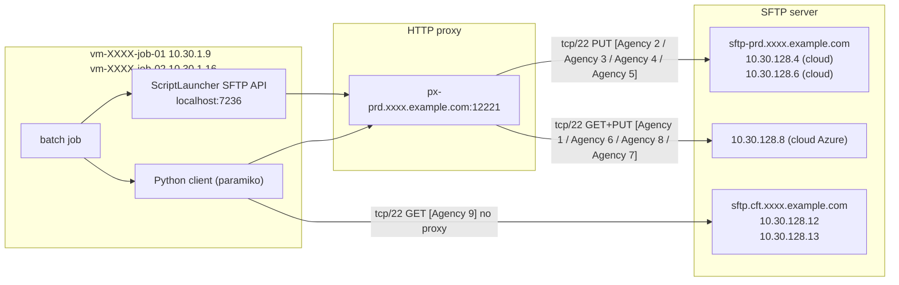
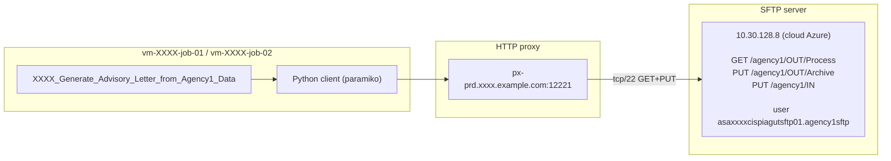
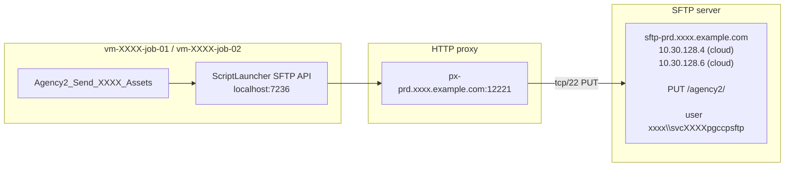
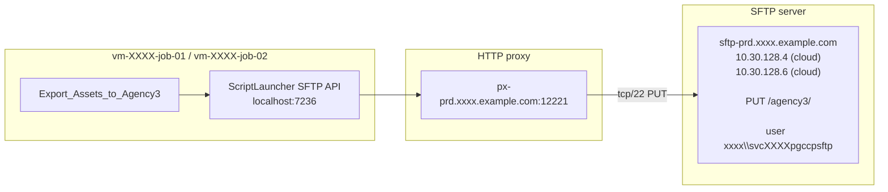
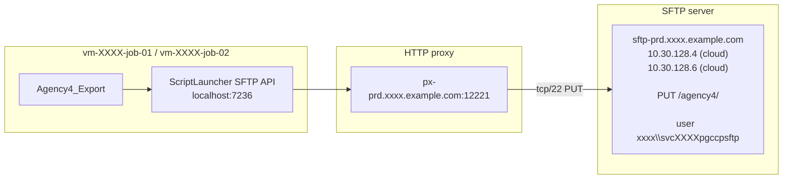
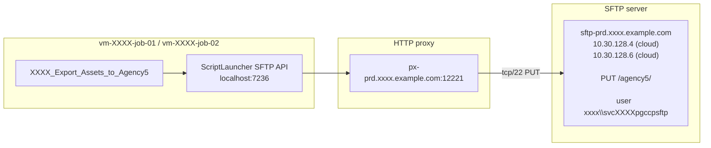
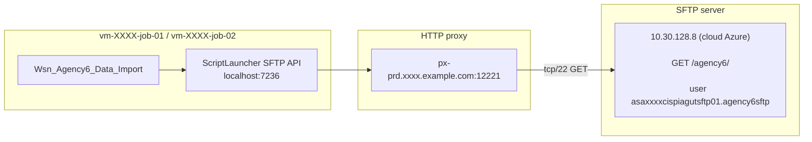
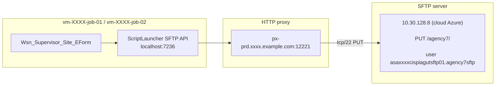
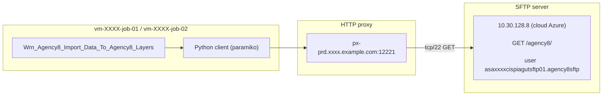
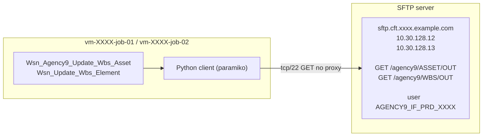

# SFTP CRs (PRD)

Same mock names and `10.30.x` space as `aws_network_diagram2.md` / `describe_json2`.

## Agency 1

## Agency 2

## Agency 3

## Agency 4

## Agency 5

## Agency 6

## Agency 7

## Agency 8

## Agency 9

